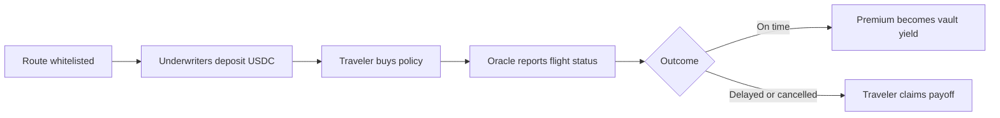

# How It Works

A Sentinel market covers one flight **route**, identified by a flight number, origin, and destination. Each route carries three terms:

- **Premium**: what a traveler pays for coverage.
- **Payoff**: what a traveler receives if the flight is delayed or cancelled.
- **Delay threshold**: how many hours late the flight must arrive to trigger a payout.

Routes are whitelisted by protocol governance. Individual policies are then sold per flight instance, keyed by flight number and departure date.

## Policy lifecycle

1. **Route whitelisting.** Governance approves a route and sets its terms, or lets it inherit protocol defaults.
2. **Capital deposit.** Underwriters deposit USDC into the Risk Vault and receive transferable vault shares (RVS).
3. **Policy purchase.** A traveler buys coverage through the Controller. The purchase only succeeds if the vault has enough free capital to fully back the payoff. That capital is then locked.
4. **Flight tracking.** An off-chain oracle pushes the scheduled arrival time, then the actual landing time (or a cancellation) to the Oracle Aggregator contract.
5. **Classification.** A keeper compares actual versus scheduled arrival against the delay threshold and marks the flight to be settled as on time, delayed, or cancelled.
6. **Settlement.**
   - *On time*: premiums are forwarded to the vault as underwriter yield, and the locked capital is released.
   - *Delayed or cancelled*: the vault tops up the flight pool so that every buyer can claim the full payoff, and a claim window opens.
7. **Claim.** Affected travelers claim their payoff directly from the Flight Pool Manager, any time before the claim window expires (60 days on testnet).
8. **Withdrawal.** Underwriters redeem shares immediately when free capital allows, or join a FIFO withdrawal queue that is processed automatically.

## Who does what

| Step | Actor | Automation |
|---|---|---|
| Whitelist routes | Owner or admin | Manual |
| Deposit and withdraw | Underwriters | Self-service |
| Buy policies | Travelers | Self-service |
| Push flight data | Oracle executor | Cron, every 2 hours |
| Classify flights | Keeper executor | Cron, hourly |
| Execute settlements | Keeper executor | Cron, every 5 minutes |
| Process withdrawal queue | Keeper executor | Cron, every 5 minutes |
| Claim payouts | Travelers | Self-service |

The cron cadences are the current executor defaults, not protocol rules. Timing is off-chain configuration and can be tuned freely, as long as the oracle and keeper run often enough for timely settlement.

Flight data comes from the FlightAware AeroAPI today, delivered by a centralized executor. The oracle backend is swappable by design, so data delivery can migrate to a decentralized backend without redeploying the contracts.
