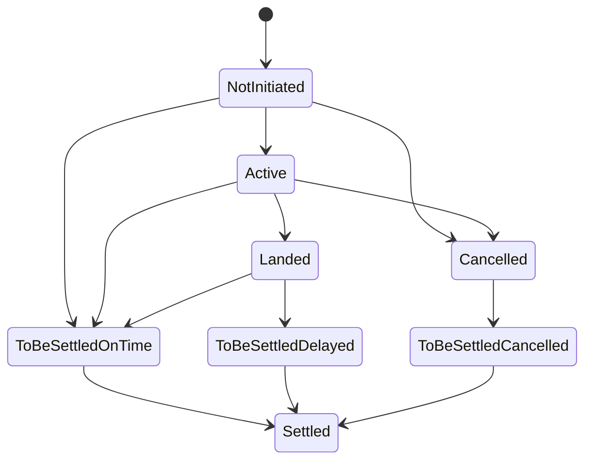

# Oracle Aggregator

The Oracle Aggregator is the authoritative on-chain record of flight status. It implements a strict forward-only state machine, so a status can never move backwards:

Two of these edges are timeout voids that guarantee every collateral-locking
state has a bounded exit. A `NotInitiated` row that never received any data
may be voided 14 days past departure, and an `Active` row that never received
a terminal outcome may be voided 14 days past its recorded scheduled arrival.
Both settle as on-time (premiums to the vault, collateral released, no
payout), and the oracle can still write the real outcome at any moment before
the void is classified. `NotInitiated` to `Cancelled` covers short-notice and
pre-purchase cancellations — the oracle can record a cancellation before any
policy exists, creating a purchase-blocking tombstone.

Each flight stores `FlightData`: status, estimated arrival time, actual arrival time, and settlement timestamp.

## Active-flight set

Registered flights are enumerable through a **paginated active set**: pages of up to 100 entries, each its own ledger entry, plus a reverse index for constant-time removal and an O(1) count. Capacity scales with pages instead of competing with the contract-instance size limit, so flight registration has no practical protocol-wide ceiling (the remaining cap is a 100,000-entry sanity bound). The keeper iterates the set in bounded windows via `get_active_flights_page`, touching at most two pages per call.

:::info[Scheduled, not estimated]
The estimated arrival time must be the published schedule (AeroAPI `scheduled_in`), never the live ETA. Comparing against a live ETA would misclassify delayed flights as on time.
:::

## Oracle-only functions

Called by the authorized oracle executor:

- `set_estimated_arrival`: records the scheduled arrival and activates the flight.
- `set_landed`: records the actual arrival time.
- `set_cancelled`: marks a cancellation (and deletes any live sale authorization for the flight).
- `open_sale(flight_id, date, expires_at)`: opens or refreshes the sale window — the oracle's short-lived attestation (at most 24 hours, never past the departure day) that the flight instance was verified scheduled and not cancelled. The Controller requires a live window for every purchase.
- `close_sale(flight_id, date)`: revokes a sale window ahead of its expiry.

## Controller-only functions

- `register_flight`: creates the flight entry at first policy purchase.
- `set_to_be_settled` and `set_settled`: driven by classification and settlement.

## Permissionless housekeeping

- `prune_settled()`: evicts flight data 7 or more days past settlement.

## Owner edge path

- `evict_missing_flight`: removes a flight whose data never arrived, paired with a Controller-side `settle_evicted_flight` to unwind its policies.

## Reads

- `get_flight_data(flight_id, date)`: never panics, returns `NotInitiated` for unknown flights.
- `get_active_flights` (whole set, off-chain use), `get_active_flights_page(offset, limit)` (bounded window), `get_active_flight_count` (O(1)), `is_flight_listed(flight_id, date)` (exact membership), `get_flights_by_status`.
- `is_sale_open(flight_id, date)`: whether an unexpired sale authorization exists — fails closed on every degraded state. `get_sale_auth` exposes the raw expiry for frontends and the executor.
