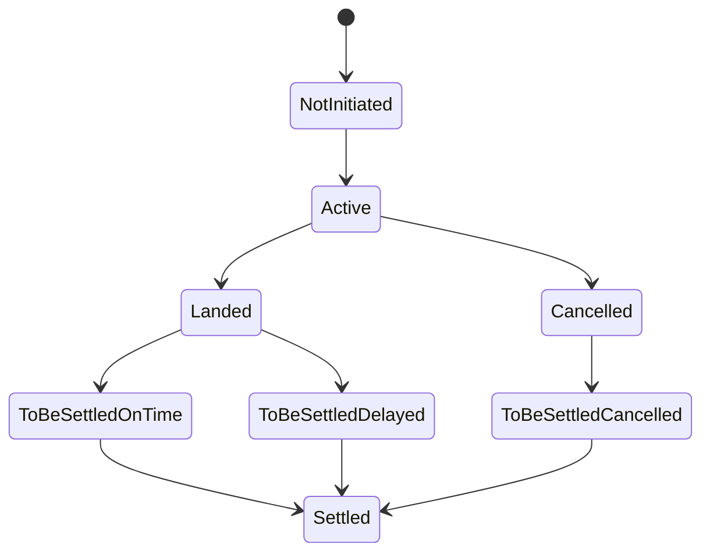

# Oracle Aggregator

The Oracle Aggregator is the authoritative on-chain record of flight status. It implements a strict forward-only state machine, so a status can never move backwards:

Each flight stores `FlightData`: status, estimated arrival time, actual arrival time, and settlement timestamp.

:::info[Scheduled, not estimated]
The estimated arrival time must be the published schedule (AeroAPI `scheduled_in`), never the live ETA. Comparing against a live ETA would misclassify delayed flights as on time.
:::

## Oracle-only functions

Called by the authorized oracle executor:

- `set_estimated_arrival`: records the scheduled arrival and activates the flight.
- `set_landed`: records the actual arrival time.
- `set_cancelled`: marks a cancellation.

## Controller-only functions

- `register_flight`: creates the flight entry at first policy purchase.
- `set_to_be_settled` and `set_settled`: driven by classification and settlement.

## Permissionless housekeeping

- `prune_settled()`: evicts flight data 7 or more days past settlement.

## Owner edge path

- `evict_missing_flight`: removes a flight whose data never arrived, paired with a Controller-side `settle_evicted_flight` to unwind its policies.

## Reads

- `get_flight_data(flight_id, date)`: never panics, returns `NotInitiated` for unknown flights.
- `get_active_flights`, `get_flights_by_status`.
