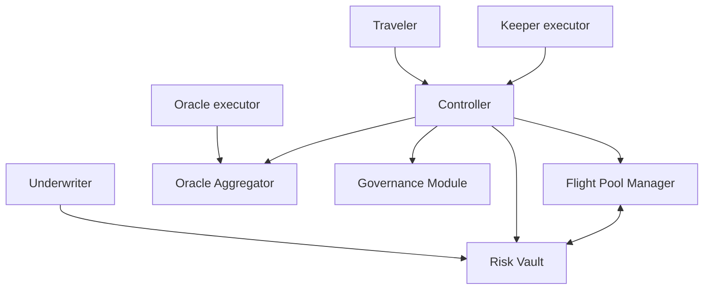

# Architecture Overview

Sentinel consists of five production contracts plus a testnet token, all written in Rust against the Soroban SDK and OpenZeppelin Stellar contracts. The source lives in the [`contracts/`](https://github.com/SentinelFi/sentinel_soroban_v3/tree/main/contracts) workspace.

| Contract | Role | Holds USDC |
|---|---|---|
| [Controller](controller) | Orchestrates all flows, enforces policy logic | No |
| [Risk Vault](risk-vault) | ERC-4626 style vault for underwriter capital | Yes |
| [Flight Pool Manager](flight-pool-manager) | Per-flight policy state, premiums, and claims | Yes |
| [Oracle Aggregator](oracle-aggregator) | Authoritative on-chain flight status | No |
| [Governance Module](governance-module) | Route whitelist and policy terms | No |
| [Mock USDC](shared-types-and-mock-usdc) | Testnet-only stablecoin with faucet | n/a |

## Design principles

- **Single orchestrator.** The Controller is the only contract that calls all others. The only other cross-contract link is between the Flight Pool Manager and the Risk Vault during settlement.
- **Money is separated from logic.** USDC sits only in the Risk Vault and Flight Pool Manager. The Controller holds nothing.
- **Immutable wiring.** Downstream contract addresses inside the Controller are fixed at deployment. Only the keeper and oracle executor addresses can be rotated.
- **Shared types.** All cross-contract data structures live in the `sentinel_types` crate so every contract agrees on one XDR layout.
- **Upgradeable but independent.** Every contract exposes an owner-gated `upgrade` function.

## Stack

- [Soroban SDK](https://developers.stellar.org/docs/build/smart-contracts) 25.x, compiled to WASM (`wasm32v1-none`).
- [OpenZeppelin Stellar contracts](https://github.com/OpenZeppelin/stellar-contracts) 0.7.x: `FungibleVault`, `Ownable`, `Pausable`, upgrade utilities.
- Asset with 7 decimals (Stellar convention). Testnet uses Mock USDC, mainnet uses the real Stellar Asset Contract.

Sequence diagrams for deployment, whitelisting, purchase, underwriting, settlement, and claims are maintained in the repository at [`sequence_diagrams.md`](https://github.com/SentinelFi/sentinel_soroban_v3/blob/main/sequence_diagrams.md).
