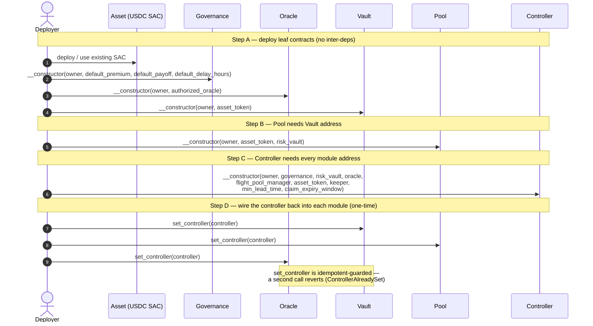
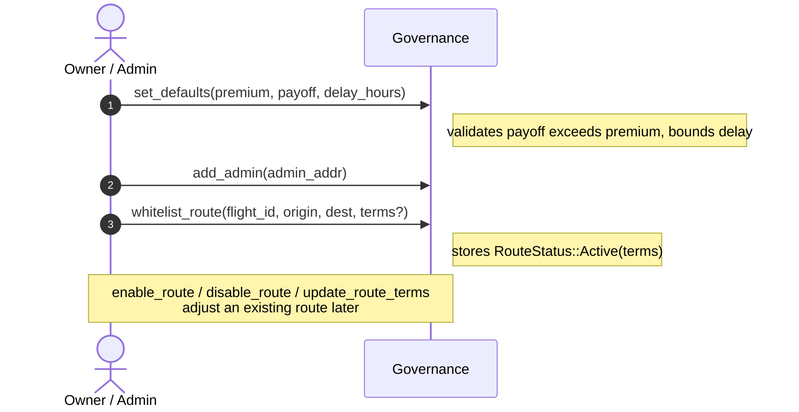
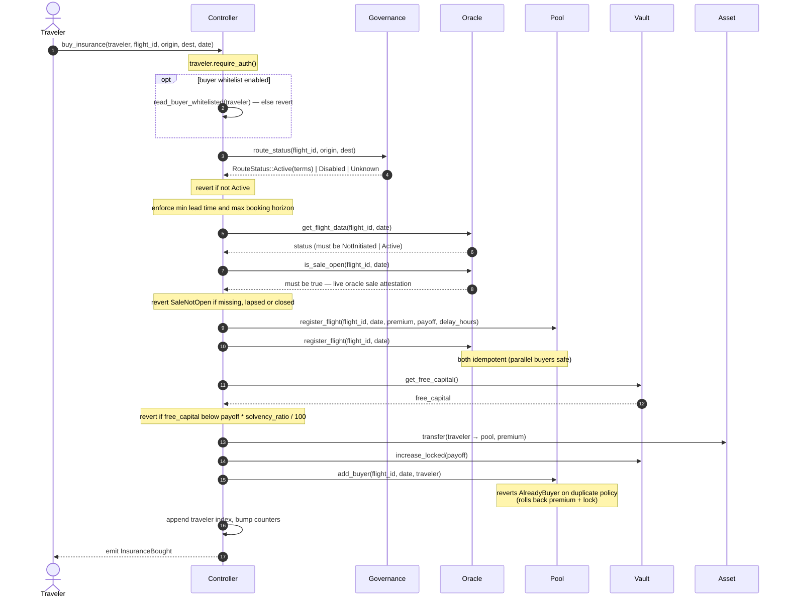
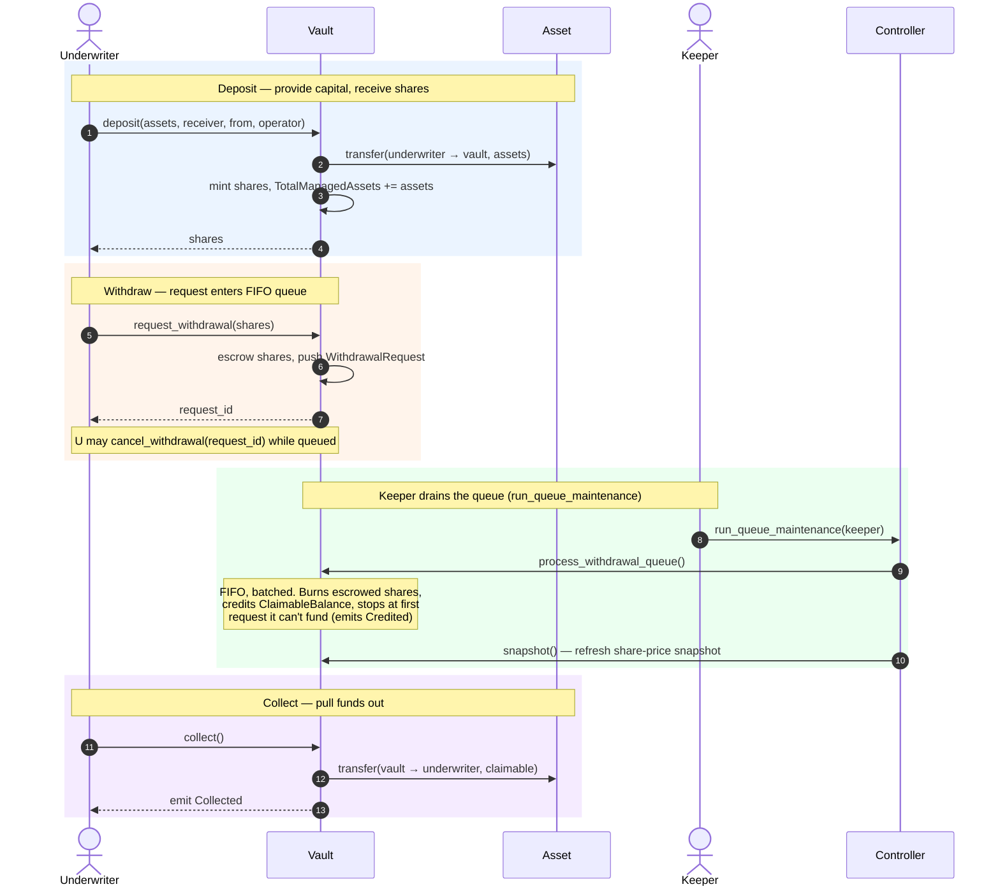
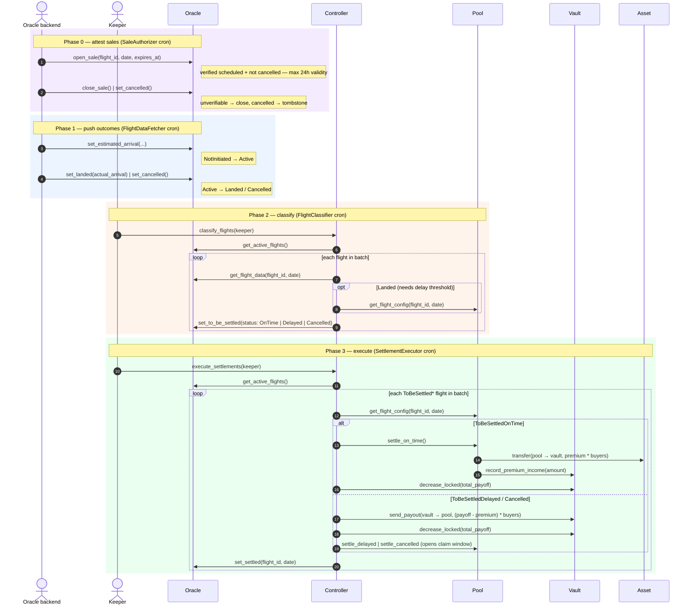
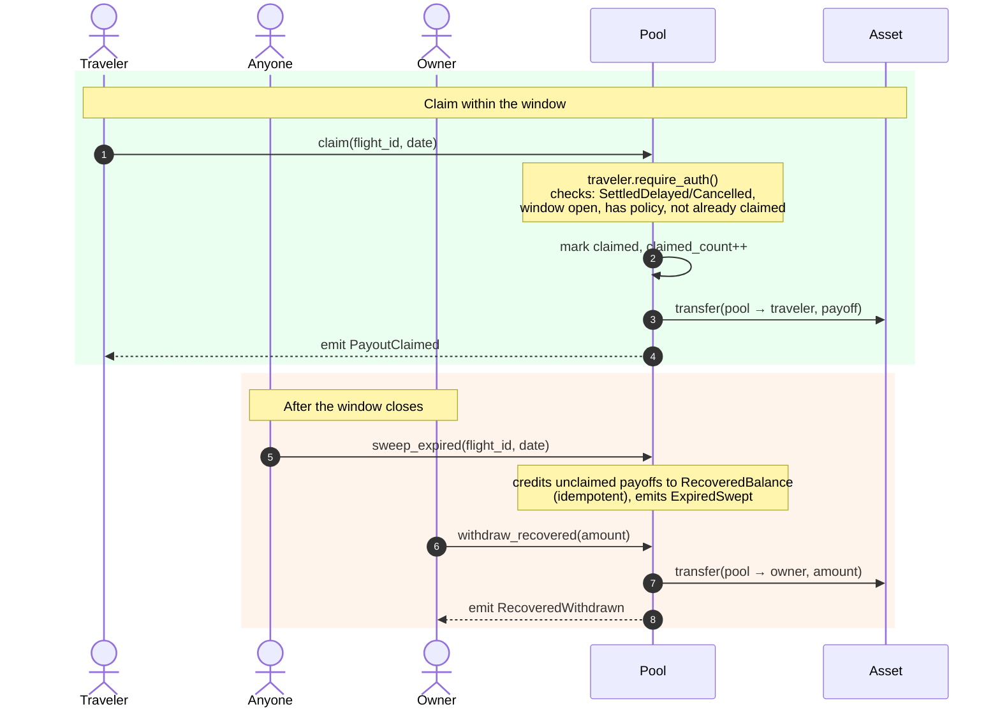

# Sequence Diagrams

Visual walkthroughs of the main cross-contract flows, for new contributors and
reviewers. They complement the prose in [architecture.md](architecture.md).

All diagrams are written in [Mermaid](https://mermaid.js.org/), which renders
automatically on GitHub and in most Markdown viewers. They are **plain text and
meant to be edited** — when a flow changes, update the relevant fenced
` ```mermaid ` block here in the same PR. To preview edits live, paste a block
into the [Mermaid Live Editor](https://mermaid.live).

## Table of Contents

- [Actors & Contracts](#actors--contracts)
- [1. Contract Deployment & Wiring](#1-contract-deployment--wiring)
- [2. Route Whitelisting (Governance Setup)](#2-route-whitelisting-governance-setup)
- [3. Insurance Purchase](#3-insurance-purchase)
- [4. Risk-Taker (Underwriter) Flow](#4-risk-taker-underwriter-flow)
- [5. Flight Data → Classification → Settlement](#5-flight-data--classification--settlement)
- [6. Claim Processing](#6-claim-processing)

---

## Actors & Contracts

| Name in diagrams | What it is |
| --- | --- |
| **Deployer** | Address that installs and instantiates the contracts (also the initial owner). |
| **Owner / Admin** | Governs parameters and routes; can pause and upgrade. |
| **Traveler** | Insurance buyer / policy holder. |
| **Underwriter** | Liquidity provider (risk taker) who deposits capital into the vault for yield. |
| **Oracle backend** | Off-chain cron that pushes flight outcomes on-chain (the authorized oracle). |
| **Keeper** | Off-chain cron that drives classification, settlement, and queue maintenance. |
| **Controller** | Orchestrator wiring governance, vault, oracle, and pool together. |
| **Governance** | `GovernanceModule` — route whitelist and premium/payoff/delay terms. |
| **Vault** | `RiskVault` — ERC-4626-style vault holding collateral; pays claims. |
| **Pool** | `FlightPoolManager` — per-flight buyers, premiums, and claim payouts. |
| **Oracle** | `OracleAggregator` — flight-status state machine and active-flight list. |
| **Asset** | The settlement token (USDC SAC / `mock_usdc`) premiums and payouts move in. |

---

## 1. Contract Deployment & Wiring

Deployment order is dictated by constructor dependencies: each contract that
references another needs that address at construction time. The vault must exist
before the pool (the pool constructor takes the vault address), and all four
modules must exist before the controller. Finally, the three module contracts are
told the controller's address via one-time `set_controller` calls — this closes
the trust loop so they only accept privileged calls from the controller.



---

## 2. Route Whitelisting (Governance Setup)

Before any flight can be insured, the route must be known to governance. The
owner sets global default terms and grants admin rights; an admin then
whitelists the specific route (optionally overriding the defaults). A purchase
later reads these terms via `route_status`.



---

## 3. Insurance Purchase

The traveler calls the controller once; the controller fans out to every module
atomically. If any step reverts (route disabled, too close to departure,
insufficient vault capital, duplicate policy), the whole transaction rolls back —
no premium is charged and no collateral is locked. Premium flows directly from
the traveler to the pool; collateral is locked in the vault to back the payoff.



---

## 4. Risk-Taker (Underwriter) Flow

Underwriters supply the capital that backs payouts and earn the premiums of
on-time flights. Deposits are immediate (ERC-4626 `deposit` mints shares).
Withdrawals are **FIFO-queued** so that a latecomer can't drain free capital
ahead of LPs already waiting: the request escrows shares, the keeper drains the
queue into pull-based claimable balances, and the underwriter collects.



---

## 5. Flight Data → Classification → Settlement

Settlement runs in three decoupled, keeper/oracle-driven phases. Decoupling
keeps each call's resource cost bounded and means a stuck settlement loop can't
block underwriter withdrawals. Each phase scans the oracle's active-flight list
with a rotating, batched cursor.



> **Housekeeping:** `prune_settled()` (permissionless) later evicts flights
> that have been settled beyond the retention window from the active list.

---

## 6. Claim Processing

After a delayed/cancelled flight settles, the payout funds sit in the pool and
the claim window is open. Each insured traveler pulls their own payoff. After the
window closes, anyone can sweep the unclaimed remainder back to the owner's
recoverable balance.


